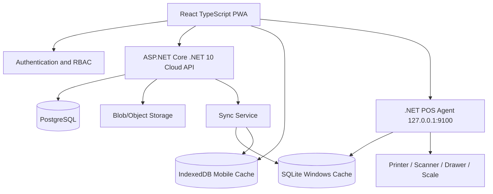
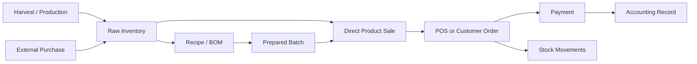

# Counterpoint Commerce and POS Platform

## 1. Overview

Counterpoint is a single web and mobile application for farm, cafe, retail, inventory, POS, and customer ordering workflows. The application presents different experiences according to the authenticated user's role while using one central domain model and one synchronization strategy.

The system must support:

- Internal operations: farm and produce tracking, purchased vendor items, inventory, recipes, prepared batches, POS sales, purchasing, accounting, and reporting.
- Customer operations: browsing products and menus, availability, pickup or delivery orders, payment status, order tracking, and future experience bookings.
- Multiple locations: farms, stores, cafes, warehouses, registers, and storage locations.
- Offline-first POS operation: a sale can be completed and printed without internet access, then synchronized later.
- Windows hardware: a local .NET agent abstracts printers, scanners, cash drawers, scales, and customer displays.
- Mobile use: the same React PWA runs on Android and iPad without requiring the Windows agent.

This specification replaces the earlier Zoho-oriented notes. Zoho is not a runtime dependency, system of record, or integration requirement. Counterpoint owns its domain model, APIs, databases, authentication, workflows, and deployment pipeline.

### 1.1 Goals

1. Provide a reliable checkout experience for staff.
2. Maintain accurate stock across farm, purchased, prepared, retail, and menu items.
3. Reuse one product and order model for internal and customer channels.
4. Protect internal data with role and location-based access control.
5. Continue essential POS operation during network outages.
6. Establish a modular foundation for online commerce and agri-tourism.

### 1.2 Non-goals for the first release

- Full accounting replacement for a regulated accounting package.
- Physical payment-terminal certification or card processing implementation.
- Automatic support for every printer and scanner manufacturer.
- Travel booking implementation in the core MVP.
- Native Android or iOS codebases; the first mobile client is a PWA.

## 2. Architecture

### 2.1 Logical architecture

### 2.2 Deployment topology

#### Cloud

- React PWA hosted by Azure Static Web Apps or equivalent static hosting.
- ASP.NET Core .NET 10 Cloud API hosted by Azure App Service or container hosting.
- Azure PostgreSQL as the authoritative operational database.
- Blob storage for product media, receipt exports, documents, and backups.
- Application Insights and centralized structured logging.
- Managed identity, secret storage, HTTPS, and private database networking where available.

#### Windows POS

- React PWA opened as a browser-installed app or managed shortcut.
- .NET POS Agent installed as a Windows Service.
- Agent binds only to `127.0.0.1:9100`.
- SQLite stores local catalog, register configuration, completed local orders, and sync queue.
- Hardware adapters implement stable interfaces; the browser never accesses USB or serial devices directly.

#### Android and iPad

- Same PWA installed from the browser.
- IndexedDB stores the local catalog and offline order queue.
- Cloud API is used over HTTPS when online.
- Printing uses network printing, AirPrint, or vendor SDK integration; the Windows agent is not required.

### 2.3 Application boundaries

**Frontend**

- React, TypeScript, Vite, PWA service worker, IndexedDB.
- Role-aware routes and feature visibility.
- Local catalog search without a request for every keystroke.
- Offline queue and retry status.

**Cloud API**

- Authentication, authorization, catalog, locations, inventory, orders, payments, reporting, and synchronization.
- Business validation and authoritative conflict decisions.
- PostgreSQL transactions for stock and order changes.

**POS Agent**

- Loopback-only minimal API.
- Device discovery and health.
- Print queue and receipt rendering.
- Scanner events, cash drawer commands, and scale readings.
- Windows Service hosting and background retry.

**Synchronization**

- Every device has a stable device and register identity.
- Every locally created order has a globally unique ID.
- Upload operations are idempotent.
- The server records accepted operations and duplicate operations separately.
- Catalog and configuration sync from cloud to devices.

## 3. Users, roles, and access control

Authentication uses short-lived access tokens with refresh tokens or an equivalent secure session mechanism. Authorization is enforced in the API and repeated in the UI for usability; hiding a screen is never the security boundary.

### 3.1 Roles

| Role | Primary capabilities |
| --- | --- |
| Owner/Admin | All locations, users, catalog, inventory, orders, finance, configuration, reports |
| Operations Manager | Products, suppliers, locations, inventory, recipes, orders, reports |
| Store/Cafe Staff | POS, customer orders, prepared batches, stock adjustments permitted by policy |
| Accountant | Payments, transactions, taxes, financial reports; no recipe or device administration unless granted |
| Customer | Public catalog, own profile, own orders, payments, bookings |
| Device/Service | Narrow machine identity for sync and device APIs; no interactive user access |

Permissions are scoped by action and location. Sensitive internal fields such as purchase cost, supplier notes, batch details, recipes, and accounting data are not exposed to customers.

## 4. Functional requirements

### 4.1 Identity and organization

- Users can sign in, sign out, reset credentials, and manage sessions.
- An organization can have multiple farms, stores, cafes, warehouses, registers, and storage locations.
- A user may be assigned to one or more locations.
- A register has a unique register ID and belongs to exactly one location.
- A device has a unique device ID and can be paired with a register.
- Admins can invite, deactivate, and assign roles to users.

### 4.2 Catalog and category management

The product catalog supports a shared internal and customer-facing category tree:

- Farm Produce: fruits, vegetables, dairy, meat/poultry/eggs, herbs/spices.
- Grocery: staples, snacks/beverages, organic/specialty, frozen foods.
- Cafe and Restaurant: breakfast/brunch, lunch/dinner, beverages, desserts/bakery.
- Packaged and Processed: jams/pickles/sauces, ready meals, packaged snacks.
- Merchandise and Accessories: clothing, mugs, bags, kitchenware, tools.
- Future Services: tours, workshops, and seasonal events.

Each sellable item supports:

- Name, SKU, barcode, description, images, category, subcategory, unit, and active status.
- Sale price, tax category, availability, and location-specific price overrides.
- Stock tracking mode: stocked product, service, recipe output, or non-stock item.
- Customer metadata: origin, freshness, ingredients, allergens, preparation time, and delivery/pickup options.
- Internal metadata: supplier, purchase cost, reorder level, storage location, batch policy, and internal notes.

### 4.3 Farm and produce management

- Record crops, livestock, dairy, eggs, meat, and harvested produce.
- Track farm origin, harvest or production date, batch/lot number, unit, quantity, storage location, expiry, and freshness status.
- Convert harvest records into inventory receipts.
- Expose customer-safe origin and freshness information.
- Retain an audit trail for adjustments and waste.

### 4.4 External purchases and suppliers

- Maintain suppliers and vendor contact details.
- Record purchased items, quantity, unit, purchase price, purchase date, batch, expiry, and destination location.
- Add received quantities to inventory through a transaction, not by overwriting stock.
- Track purchase status: draft, received, partially received, cancelled.
- Link purchase cost to inventory valuation and accounting transactions.

### 4.5 Inventory and stock

- Track stock by item, batch, location, and unit.
- Support available, reserved, damaged, expired, consumed, and on-order quantities.
- Calculate available stock as a controlled value from stock movements.
- Support stock receiving, transfer, adjustment, wastage, cycle count, and reservation.
- Configure reorder levels and low-stock alerts.
- Prevent sale of expired or unavailable batches according to item policy.
- Keep immutable stock movement records with user, device, reason, and timestamp.

### 4.6 Recipes, BOMs, and prepared items

- Create recipes/BOMs for cafe items and prepared products such as vada, halwa, and savory items.
- Link each ingredient to an inventory item and quantity per output unit.
- Record a production batch with quantity produced, preparation date, expiry, location, and staff member.
- Deduct raw ingredients when a batch is produced, according to the recipe.
- Add finished quantity to prepared-item stock.
- Deduct prepared stock when sold.
- Calculate estimated cost per prepared item and retain the ingredient snapshot used for the batch.
- Prevent production when required raw stock is unavailable unless an authorized override is recorded.

### 4.7 POS and internal orders

- Search the local catalog by name, SKU, barcode, category, or scan event.
- Add items, quantities, modifiers, discounts, customer, tax, payment method, and fulfillment type.
- Support dine-in, takeaway, pickup, and internal sale order types.
- Calculate subtotal, discount, tax, total, and rounding using server-approved rules.
- Save the order locally before attempting network synchronization.
- Print a receipt locally where hardware is available.
- Open the cash drawer only for permitted cash workflows.
- Support void, refund, cancellation, and reprint with permissions and audit records.

### 4.8 Customer ordering

- Customers can browse customer-visible products and cafe menu items.
- Customers can see availability, price, images, allergens, origin, and preparation time where configured.
- Customers can create pickup or delivery orders.
- Customers can provide contact, address, schedule, and special instructions.
- Customers can view payment and fulfillment status for their own orders.
- Staff can accept, prepare, assign, complete, cancel, and mark orders ready for pickup or delivery.

### 4.9 Payments and accounting records

- Support cash, card-terminal reference, online payment reference, and other configured methods.
- Store payment status separately from order status: pending, authorized, paid, failed, partially refunded, refunded.
- Record tax/GST, amount, currency, payment method, provider reference, and timestamps.
- Generate accounting transaction records linked to orders, purchases, refunds, and expenses.
- Restrict financial reports and purchase cost to authorized roles.
- Integrate with an external payment provider or accounting system only through explicit adapters; the core system remains authoritative for operational records.

### 4.10 Reporting and alerts

- Daily sales by location, register, channel, category, payment method, and tax.
- Current stock, low stock, expiry, waste, transfers, and inventory valuation.
- Product and prepared-item margin estimates.
- Open orders by status and fulfillment time.
- Farm yield and batch traceability reports.
- Export authorized reports as CSV and, later, PDF.
- Notify staff of low stock, expiring batches, failed sync, failed payments, and device faults.

### 4.11 Future agri-tourism module

The model must allow a service item with capacity and schedule without changing product or order primitives:

- Tour/workshop/event name, category, description, media, price, schedule, capacity, available slots, booking status, assigned guide, and customer notes.
- Booking creates a reservation and payment record.
- Capacity is reserved transactionally and released on cancellation.

## 5. Core workflows

### 5.1 Offline POS sale

1. Device loads the latest catalog and register configuration.
2. Staff searches locally and builds an order.
3. The client validates stock from its local snapshot.
4. The order receives a globally unique ID and is committed to local storage.
5. Payment is captured or recorded according to the configured offline policy.
6. Receipt is sent to the local print adapter.
7. Stock and accounting operations are added to the sync queue.
8. When online, the sync service uploads operations idempotently.
9. The cloud validates, applies, and returns accepted, duplicate, or rejected results.

### 5.2 Farm or vendor stock to sale

### 5.3 Customer order lifecycle

`Draft -> Submitted -> Accepted -> Preparing -> ReadyForPickup/OutForDelivery -> Completed`

Exceptional states: `PaymentPending`, `PaymentFailed`, `Cancelled`, `Refunded`.

## 6. Data model

PostgreSQL is the cloud source of truth. SQLite and IndexedDB are projections/caches with queued operations, not independent sources of truth.

### 6.1 Entity overview

| Entity | Important fields |
| --- | --- |
| Organization | id, name, currency, tax configuration |
| User | id, organization_id, name, email, status |
| Role/Permission | role, permission, scope, location_id |
| Location | id, type, name, address, timezone, active |
| Register/Device | register_id, device_id, location_id, pairing status, last seen |
| Category | id, parent_id, name, customer_visible, active |
| Product | id, sku, barcode, name, type, category_id, unit, active |
| ProductPrice | product_id, location_id, amount, tax_code, valid_from, valid_to |
| ProductMedia | product_id, blob_key, alt_text, sort_order |
| Supplier | id, name, contact, status |
| Batch | id, product_id, lot_number, origin, produced_at, expires_at |
| InventoryBalance | product_id, location_id, batch_id, on_hand, reserved, available |
| StockMovement | id, product_id, location_id, batch_id, type, quantity, source_id, actor_id |
| Purchase | id, supplier_id, location_id, status, total, created_at |
| PurchaseLine | purchase_id, product_id, quantity, unit_cost, batch_id |
| Recipe | id, output_product_id, version, active |
| RecipeIngredient | recipe_id, input_product_id, quantity, unit |
| ProductionBatch | id, recipe_id, location_id, quantity, expires_at, status |
| Customer | id, name, email, phone, addresses |
| Order | id, channel, type, customer_id, location_id, register_id, status, totals |
| OrderLine | order_id, product_id, quantity, unit_price, tax, discount, snapshot |
| Payment | id, order_id, method, status, amount, provider_reference |
| AccountingTransaction | id, order_id, purchase_id, type, amount, tax, ledger_code |
| SyncOperation | id, device_id, operation_type, entity_id, payload, state, attempts |
| AuditEvent | id, actor, action, entity_type, entity_id, before, after, timestamp |
| Booking | id, service_product_id, schedule, customer_id, quantity, status |

### 6.2 Data rules

- IDs are UUIDs; human-readable order numbers are separate and scoped by location/register.
- SKU and barcode uniqueness is enforced within an organization.
- Money is stored as decimal with explicit currency; floating point is not used for persisted amounts.
- Stock is changed only through stock movements or transactional order allocation.
- Order and payment records are append-oriented; corrections create reversal/refund records.
- Customer APIs return only customer-visible fields and the authenticated customer's own records.
- Every mutable operational entity has `created_at`, `updated_at`, and an optimistic concurrency token.

### 6.3 Local storage

The browser stores catalog snapshots, register configuration, customer-safe order history, and queued orders in IndexedDB. Windows stores the same operational projection and queue in SQLite through the POS Agent. Queue records include device ID, operation ID, entity ID, creation time, retry count, and last error.

## 7. API contract

Cloud API base URL in development: `http://localhost:5080`; production uses HTTPS.

| Area | Endpoints |
| --- | --- |
| Auth | `/api/auth/login`, `/api/auth/refresh`, `/api/auth/logout`, `/api/auth/me` |
| Catalog | `GET/POST /api/products`, `GET/PATCH /api/products/{id}`, `/api/categories` |
| Locations | `/api/stores`, `/api/locations`, `/api/registers`, `/api/devices` |
| Inventory | `/api/inventory`, `/api/stock-movements`, `/api/purchases`, `/api/production-batches` |
| Recipes | `/api/recipes`, `/api/recipes/{id}/ingredients` |
| Orders | `/api/orders`, `/api/orders/{id}`, `/api/orders/{id}/status` |
| Payments | `/api/payments`, `/api/payments/{id}/refund` |
| Reports | `/api/reports/sales`, `/api/reports/inventory`, `/api/reports/farm-yield` |
| Sync | `POST /api/sync`, `GET /api/sync/catalog`, `GET /api/sync/status` |

Local POS Agent base URL: `http://127.0.0.1:9100`.

| Area | Endpoints |
| --- | --- |
| Health | `GET /health`, `GET /devices` |
| Printing | `GET /printers`, `POST /print` |
| Scanner | `POST /scanner/start`, `POST /scanner/stop`, scanner event stream |
| Drawer | `POST /cash-drawer/open` |
| Scale | `GET /scale` |

The cloud API requires authenticated user/device requests. The local agent accepts only loopback traffic and must add pairing/authentication before production use.

## 8. Non-functional requirements

### Reliability and offline behavior

- A completed offline POS order must survive browser restart or agent restart.
- Sync retries use exponential backoff and idempotency keys.
- Duplicate sync requests must not create duplicate orders or payments.
- Receipt printing failure must not lose the order.
- Health endpoints expose database, queue, and device status.

### Performance

- Local catalog search responds within 100 ms for a 10,000-item catalog on supported POS devices.
- The first usable POS screen loads within 3 seconds on a normal broadband connection after cache warm-up.
- Cloud API p95 read latency target is below 500 ms under expected Phase 1 load.
- Checkout UI must remain responsive while sync and printing happen in the background.

### Security and privacy

- HTTPS is mandatory outside local development.
- Passwords are never stored in the client.
- Secrets are stored in a managed secret store or environment variables, never in source control.
- Server-side RBAC, location scoping, input validation, rate limits, and audit logging are mandatory.
- Payment card data is never stored; use a PCI-compliant payment provider.
- Customer personal data is encrypted in transit and access is logged.
- The POS Agent binds to `127.0.0.1`, runs with least privilege, and validates requests from the paired PWA/device.

### Observability

- Structured logs with correlation ID, device ID, register ID, and order ID where applicable.
- Metrics for API latency, sync queue depth, failed sync, payment failures, stock conflicts, and printer failures.
- Alerts for service downtime, database failure, growing queue, and repeated hardware failures.
- Audit records for privileged changes, refunds, stock adjustments, and configuration changes.

### Maintainability

- Domain logic is independent of HTTP, UI, and hardware implementations.
- Database migrations are versioned and repeatable.
- Hardware is accessed only through interfaces such as `IReceiptPrinter`, `IBarcodeScanner`, `ICashDrawer`, and `IScale`.
- API contracts and event payloads are versioned.
- Automated tests run before merge and deployment.

## 9. Testing strategy

- Frontend unit tests: totals, discounts, role navigation, offline queue behavior.
- Frontend component tests: catalog search, cart, checkout, customer order tracking.
- Cloud unit tests: pricing, tax, inventory, recipe consumption, permissions, idempotency.
- API integration tests: PostgreSQL test database, migrations, authentication, sync, and concurrency.
- POS Agent tests: mock printer, scanner, drawer, scale, queue retry, and loopback binding.
- End-to-end tests: customer order, staff fulfillment, offline sale, reconnect/sync, receipt queue.
- Security tests: unauthorized routes, tenant/location isolation, token handling, and input validation.

## 10. CI/CD

GitHub Actions is the reference pipeline. Equivalent Azure DevOps pipelines are acceptable if they preserve the same gates.

### Pull request pipeline

1. Restore and validate repository structure.
2. Install Node dependencies with the lockfile.
3. Run frontend typecheck, lint, unit tests, and production build.
4. Restore .NET projects and run formatting/checks.
5. Run .NET unit and integration tests with a disposable PostgreSQL service.
6. Build Cloud API and POS Agent artifacts.
7. Run dependency and secret scanning.
8. Publish test results and coverage; block merge on failures.

### Main branch pipeline

- Build immutable frontend and backend artifacts.
- Apply database migrations only through an approved deployment job.
- Deploy to a development environment automatically.
- Run smoke tests for `/health`, catalog, sync, and device mocks.
- Retain artifacts and deployment metadata.

### Production pipeline

- Require approval after development/staging verification.
- Deploy API using blue/green or rolling deployment.
- Deploy static frontend with cache invalidation.
- Run backward-compatible migrations before application rollout.
- Verify health, login, catalog, order creation, and sync.
- Roll back application artifacts if smoke checks fail; never automatically roll back destructive data migrations.

### Environments

| Environment | Purpose |
| --- | --- |
| Local | Developer machine, mock hardware, local PostgreSQL/Docker |
| Development | Shared integration, test data, mock payment and devices |
| Staging | Production-like validation, masked data, release candidate |
| Production | Azure services, real authentication, payments, backups, monitoring |

## 11. Phase-wise implementation plan

### Phase 0: Foundation

- Finalize domain identifiers, location model, roles, permissions, and API conventions.
- Create solution structure, configuration, migrations, local setup, and CI checks.
- Establish frontend routing and shared design system.
- Deliver health endpoints, structured logging, and environment configuration.

### Phase 1: Farm, cafe, inventory, and POS MVP

- Implement organizations, locations, users, products, categories, suppliers, batches, and inventory movements.
- Implement farm harvest and external purchase receipts.
- Implement recipes, production batches, prepared-item stock, and ingredient deduction.
- Implement staff POS, payments as recorded references, receipt queue, and offline sync.
- Implement mock hardware adapters and Windows Agent development mode.
- Deliver daily sales and stock reports.

**Exit criteria:** staff can receive farm/vendor stock, prepare menu items, complete offline or online sales, print/mock-print receipts, and reconcile stock movements.

### Phase 2: Customer ordering and role-based single app

- Add customer registration/profile and customer-visible catalog.
- Add pickup and delivery order creation, status tracking, and notifications.
- Add customer-safe product media, origin, freshness, allergens, and availability.
- Enforce API and UI RBAC for Admin, Manager, Staff, Accountant, and Customer.

**Exit criteria:** a customer can order an available item, staff can fulfill it, stock is updated once, and the customer can track status.

### Phase 3: Multi-location and production hardening

- Add location-specific pricing, registers, devices, transfers, and stock reservations.
- Install POS Agent as a Windows Service with startup recovery.
- Add real printer/scanner/drawer/scale adapters behind interfaces.
- Add stronger conflict handling, backups, restore drills, monitoring, and operational dashboards.

**Exit criteria:** multiple locations can trade independently while synchronizing to one cloud source of truth with traceable audit records.

### Phase 4: Finance, commerce, and integrations

- Add payment-provider integration and refund workflows.
- Expand accounting, tax, expenses, COGS, margin, and export reports.
- Add promotions, customer loyalty, delivery integration, and richer media management.
- Add external integrations only through versioned adapters.

### Phase 5: Agri-tourism and advanced operations

- Add service products, schedules, capacity, bookings, guides, notifications, and cancellation rules.
- Add farm yield analytics, demand planning, and production recommendations.
- Add advanced customer communications and operational automation.

## 12. Definition of done

A feature is complete when:

- Its role and location permissions are defined.
- Its API contract and persistence model are versioned.
- Online and relevant offline behavior are implemented.
- Audit, error, and retry behavior are defined.
- Unit, integration, and workflow tests cover the important paths.
- The frontend exposes only fields appropriate to the current role.
- Documentation and local setup instructions are updated.
- CI passes and the feature has a deployable artifact.
